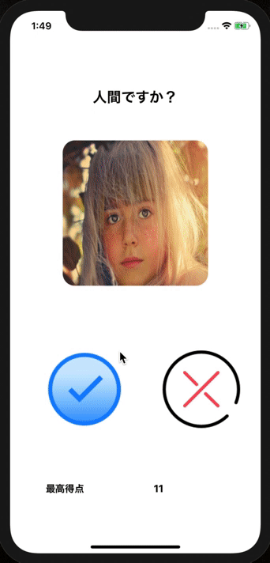
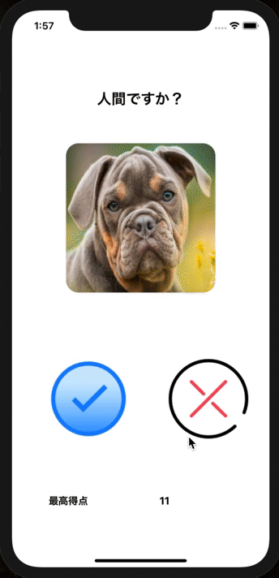

<h2 align="center">Quiz App</h2>

  

# 概要
写真に映ったものが人間かどうかを回答する**クイズアプリ**です。ユーザーが回答後、正答数が表示され、今までの最高得点が更新されます。

# 制作背景
アプリを作成しながら、条件分岐・UserDefaults・音声ファイルの実装方法を身に付けるため。

# DEMO
## 1 写真に映るものが「人間かどうか」を判断し、二択のボタンで回答する

  

## 2 全問回答後、正答数が表示され、獲得した点数が最高得点を上回れば更新される

  

# 工夫したポイント
- ユーザーが回答する際に、正解音と不正解音を流すことで、現在どの程度の正答率かが推測できるようにしました。
- UserDefaultsを使って、記録更新ができるようにしたことで、競技要素を追加しました。
- ボタン・文字・写真を大きく配置することで、ユーザーの操作性を高く保つように設計しました。
- 機能を限定的にすることで、ユーザーの操作性を高く保つように設計しました。

# 使用技術(開発環境)
Swift/Xcode/Github/UserDefaults

# 課題や今後実装したい機能
<dl>
  <dt>iPhone11にしか対応していないので、他の機種で使用するとビューが崩れてしまう</dt>
  <dd>AutoLayout等を用いて、多様な機種に対応できるようにしたい</dd>
  <dt>問題が簡単すぎる</dt>
  <dd>問題の質をあげ、ユーザーの満足度を高める必要がある</dd>
</dl>

# DB設計
